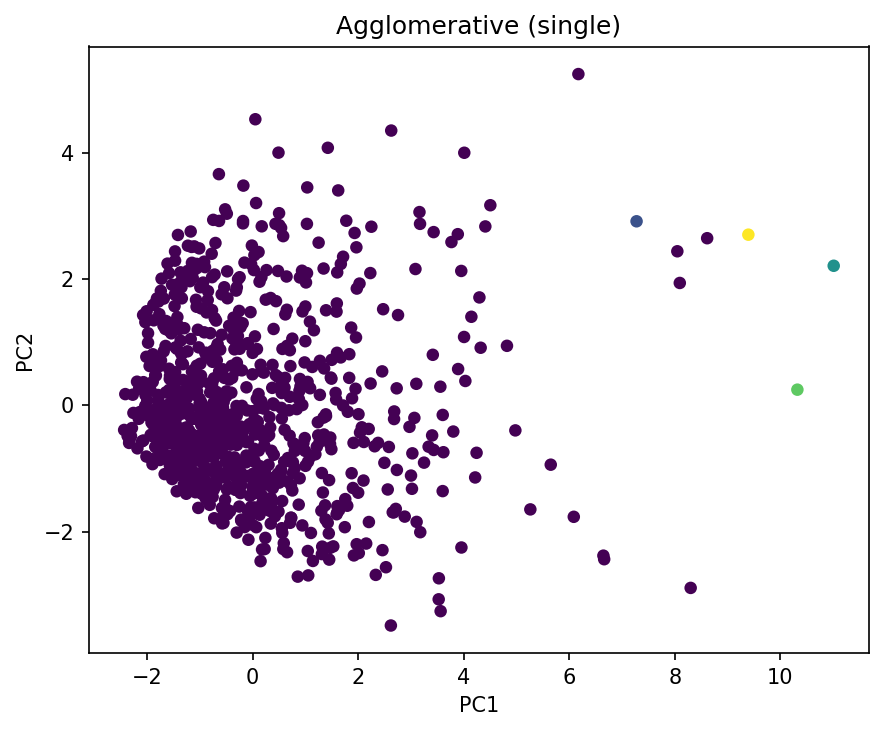
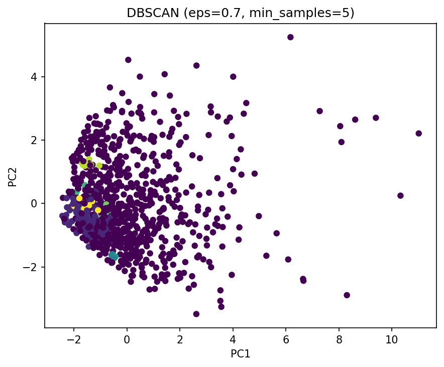

#  Customer Segmentation using Clustering Algorithms


##  Overview
This project explores **customer segmentation** using popular clustering algorithms:  
-  **K-Means Clustering**  
-  **Agglomerative Clustering** (Single & Complete Linkage)  
-  **DBSCAN**

Dimensionality reduction via **PCA (2D visualization)** allows us to see how clusters differ in space.  
We assess the results using **Silhouette Coefficient**, and optionally **Purity** and **Adjusted Rand Index** (if ground truth exists).

---

##  Dataset
The project uses the **Mall Customers dataset**.

Path: `data/Mall_Customers.csv`  
Public source:  
[IBM Cust_Segmentation.csv](https://s3-api.us-geo.objectstorage.softlayer.net/cf-courses-data/CognitiveClass/ML0101ENv3/labs/Cust_Segmentation.csv)

If you don’t have the file locally, the script can **download it automatically** with:
```bash
python -m src.main --download-ibm
```

---

##  Project Structure
```bash
clustering-project/
├── data/
│   └── Mall_Customers.csv
├── outputs/
│   ├── kmeans_clusters.png
│   ├── agg_single_clusters.png
│   ├── agg_complete_clusters.png
│   ├── dbscan_clusters.png
│   └── silhouette_scores.csv
├── src/
│   ├── data_loader.py
│   ├── preprocessing.py
│   ├── clustering_kmeans.py
│   ├── clustering_agglomerative.py
│   ├── clustering_dbscan.py
│   ├── evaluation.py
│   ├── plotting.py
│   └── main.py
├── requirements.txt
└── README.md
```

---

##  How to Run

1️⃣ Install dependencies  
```bash
pip install -r requirements.txt
```

2️⃣ Run the full pipeline  
```bash
python -m src.main --download-ibm --k 5 --eps 0.7 --min_samples 5 --out outputs
```

3️⃣ Optional flags:
| Flag | Description | Default |
|------|--------------|----------|
| `--data` | Path to local CSV file | `data/Mall_Customers.csv` |
| `--k` | Number of clusters for K-Means & Agglomerative | 5 |
| `--linkages` | Agglomerative linkages (single, complete, ward) | single, complete |
| `--eps` | DBSCAN epsilon | 0.7 |
| `--min_samples` | DBSCAN min samples | 5 |
| `--impute` | Missing value strategy (`mean`, `median`, `most_frequent`) | `median` |

Example:
```bash
python -m src.main --impute mean --linkages single complete ward
```

---

## Outputs
Each algorithm produces:
-  **Cluster visualizations** (saved in `outputs/`)
-  **Silhouette scores** (`silhouette_scores.csv`)

Example visualizations:

| Algorithm | Example Output |
|------------|----------------|
| K-Means |  |
| Agglomerative (Single) |  |
| DBSCAN |  |

---

##  Key Learnings
- Difference between partition-based (K-Means) and density-based (DBSCAN) methods  
- How distance metrics affect Agglomerative Clustering  
- PCA for high-dimensional visualization  
- Silhouette score interpretation for model selection  

---

##  Author
 **Negin Ebrahimi**  
 Master’s Student | Data Science Enthusiast  
 [GitHub Profile](https://github.com/Ebrahiminegin67)

---
 *If you like this project, give it a star on GitHub!* 
